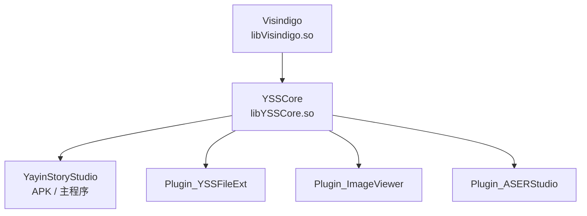

# qt_creator — YayinStoryStudio Qt-for-Android 工程

本目录是一个 **Qt Creator / CMake** 工程，用于把仓库真实的桌面源码
（`../src`，Windows / MSVC / Qt 6.10.3 的 `.sln` 工程）以 **CMake** 形态编译到
**Android**。它不复制源码、不派生分支——所有 `.cpp/.h/.qrc` 均直接编译 `../src`
中的原文件，因此与桌面工程共享同一份代码。

## 目录结构

```
qt_creator/
├─ CMakeLists.txt                    # 顶层工程：模块装配顺序 Visindigo→YSSCore→App/Plugins
├─ cmake/YSSModule.cmake             # 源码收集 / Qt 链接辅助
├─ modules/Visindigo/CMakeLists.txt  # 基础框架库  → libVisindigo.so
├─ modules/YSSCore/CMakeLists.txt    # 编辑器核心库 → libYSSCore.so
├─ app/YayinStoryStudio/CMakeLists.txt # 主程序     → APK（qt_add_executable）
│  └─ android/AndroidManifest.xml    # Android 清单（MANAGE_EXTERNAL_STORAGE/INTERNET 等）
└─ plugins/…/CMakeLists.txt          # 三个运行时插件（共享库 .so，不随 APK 分发）
```

模块依赖图（与 Windows `.sln` 一致）：



## 快速开始

1. 打开工程：Qt Creator → `File ▸ Open File or Project` → 选择
   `qt_creator/CMakeLists.txt`。
2. 选择 **Qt for Android Kit**（例如 `Qt 6.10.x Android arm64-v8a`），
   并确保该 Kit 的 Qt 安装包含 **Qt Sql** 模块（`VirtualStorage` 需要 `QSQLITE`），
   同时配好 NDK / SDK / JDK（Kit 管理里检查）。
3. 直接 `Build ▸ Run`——Qt Creator 会调用 `androiddeployqt` 生成并安装 APK。

> 说明：Android 清单/权限已由 `app/YayinStoryStudio/android/AndroidManifest.xml`
> 提供（含 `MANAGE_EXTERNAL_STORAGE`、`INTERNET` 等），包名暂为
> `cn.yxgeneral.yayinstorystudio`，需要时直接在清单里改。

## Android 存储路径与「管理全部文件」权限

主程序在 Android 上会把 Visindigo 的四个环境路径（`EnvKey`）指到**用户共享存储**中的
`YayinStoryStudio` 文件夹（不是 `android/data` 应用私有目录）。实现位于
`../src/YayinStoryStudio/main.cpp` 的 `#ifdef Q_OS_ANDROID` 引导块 `YSSAndroid::setupPublicUserFolder()`：

| `EnvKey` | 目录 |
|---|---|
| `LogFolderPath` | `/storage/emulated/0/YayinStoryStudio/logs`（含崩溃报告、命令历史） |
| `PluginFolderPath` | `/storage/emulated/0/YayinStoryStudio/plugins`（插件 .so 放这里） |
| `ConfigPath` | `/storage/emulated/0/YayinStoryStudio/config`（插件配置在其 `plugins/` 子目录） |
| `ThemeFolderPath` | `/storage/emulated/0/YayinStoryStudio/themes` |

> 项目目录（`Project repos`）也在共享存储：`/storage/emulated/0/YayinStoryStudio/repos`。
> 模板/对话框的默认项目路径经占位符 `$(visindigo::userDataPath)/repos` 解析：`userDataPath`
> 桌面 = `<当前目录>/user_data`，Android = 共享 `…/YayinStoryStudio`（实现在
> `src/Visindigo/General/cpp/VIGeneral_p.cpp` 的 placeholder 提供器里）。因此桌面行为不变，
> Android 上项目落到共享存储（文件管理器可见、可管理）。

路径根通过 Android `Environment.getExternalStorageDirectory()` 获取（真机/模拟器通常是
`/storage/emulated/0`），不硬编码、也不落入 `android/data`。首次启动若检测到未开启
「管理全部文件」（`MANAGE_EXTERNAL_STORAGE`，Android 11+），`main()` 会自动跳转系统
设置页引导授权；开启后**重新打开应用**即可正常读写。

> 说明：`EnvKey` 本身没有 `PluginConfigPath`——各插件配置文件由框架放在
> `ConfigPath + "/plugins"`；插件**二进制**（.so）放在 `PluginFolderPath`。

## 为兼容 Android 而对 `../src` 做的最小改动

> 全部改动都保持 **MSVC 桌面构建行为不变**（多数只在非 MSVC/Android 分支生效）。
> 用 `git diff` 可精确核对这 8 处。

| 文件 | 改动 |
|---|---|
| `src/YSSCore/YSSCoreCompileMacro.h` | `__declspec` 导出宏包进 `#ifdef _MSC_VER`；非 MSVC 置空（对齐 Visindigo 写法） |
| `src/Plugin_ASERStudio/ASERStudioCompileMacro.h` | 同上，加平台分支 |
| `src/Plugin_ImageViewer/ImageViewerCompileMacro.h` | 同上，加平台分支 |
| `src/Plugin_YSSFileExt/Macro.h` | 同上，加平台分支 |
| `src/YSSCore/Editor/cpp/EditorPlugin.cpp` | 修复 include 笔误 `#include <General/TranslationHost.h.>` → 去掉尾随点 |
| `src/YayinStoryStudio/YayinStoryStudio.cpp` | `Main::onPluginEnable()` 中桌面安装器（更新服务 IPC）与 ExtTool 注册表文件关联逻辑加 `#ifndef Q_OS_ANDROID` 守卫 |
| `src/Visindigo/General/private/AUTO_VERSION.h` | 将 MSVC 专属 `#pragma execution_character_set("utf-8")` 包进 `#ifdef _MSC_VER`（经公开头 `Version.h` 传播，Android/Clang 下会产生大量告警） |
| `src/Visindigo/pytools/AutoVersionFromGIT.py` | 生成脚本同步加 `#ifdef _MSC_VER` 包裹 pragma，保证重新生成后一致 |

## 各目标的编译要点

- **Visindigo / YSSCore**：以 **SHARED** 编译（`libVisindigo.so`/`libYSSCore.so`），
  镜像生产环境 `DllRelease` 的 DLL 分层；定义 `Visindigo_EXPORT`/`YSSCore_EXPORT`。
- **`Widgets/cpp/DesktopHacker.cpp` 不参与本工程编译**：该文件是未启用、Win32-only
  的单元（`MainWin.cpp` 中调用为注释），且与 Qt6 CMake 注入的 `UNICODE` 宏不相容。
  Windows `.sln` 桌面构建不受影响（其不定义 `UNICODE`，照旧编译该文件）。
- **主程序**用 `qt_add_executable`；Windows 的 `.rc` 资源不参与编译（图标等改由
  `.qrc` 内嵌）。
- **三个插件**以 SHARED 编译，产出 `libPlugin_*.so`，并定义了各自的 `*_EXPORT`。
  **随 APK 的 `lib/<abi>/` 打包**：插件目标被主程序链接（DT_NEEDED），`androiddeployqt`
  会收进 APK；主程序启动时以**入口函数指针** `setPluginEntryPoint` 注入，由
  `PluginManager` 统一排序/加载/启用（见下文「插件发布包」）。请勿把 plugin_build 的
  `.vpl` 复制到设备共享 `plugins/` 目录（Android 无法从外置存储 dlopen）。

## 已知限制 / 需要继续适配的部分

本项目目标是"**能用于 Android 编译的工程**"，已完成编译层适配与运行时守卫；
以下问题按性质列出，供后续迭代：

1. **YSSInstaller 不参与**：它是 Windows 桌面"更新/遥测后台服务"伴生 EXE，
   概念上不存在于 Android，已整体排除。
2. **ASE-Remake 引擎联动不可用**：`Plugin_ASERStudio` 的
   `ASEREnv/ASERProgram.cpp` 中与 Windows Unity 引擎的进程/窗口/命名管道桥接
   在非 Windows 下是桩实现。AStoryX 语言工具（语法/补全/高亮）可正常编译保留，
   但"启动引擎播放"功能在 Android 上无意义。
3. **运行时插件发现机制（架构级，下一步重点）**：
   - 桌面：`PluginManager` 递归扫描 `*.vpl` 目录 + 同名 `.vpl.json`（读 ID/依赖）
     → `QLibrary::load` → `resolve("VisindigoPluginMain")`，默认目录
     `./user_data/plugins`。
   - Android：插件的 `.so` 设计为**外部自由安装**（放到
     `/storage/emulated/0/YayinStoryStudio/plugins/`），因此**不随 APK 打包**。
     注意：Android 动态链接器通常只允许从应用自身命名空间（APK `lib/<abi>/`、
     应用私有目录）`dlopen`，对共享存储里的 `.so` 一般会拒绝执行——这是系统限制
     （W^X / 链接器命名空间），不是工程可绕过的。可选下一步：
     a) 扩展 `PluginManager` 支持 `lib*.so`/`.vpl` 扫描，并先把外部 .so **拷贝到
        应用私有/原生库目录**再 `QLibrary::load`；
     b) 或走框架已有的 `LoadType::FromMemory` 路径，在
        `src/YayinStoryStudio/main.cpp` 用 `app.addDependencyPlugin(new …)` 静态注册
        （此时插件目标应改 STATIC，并去掉各自入口的 `*_EXPORT` 编译开关）。
   - 仓库 `PluginBinaryHelper.h` 已预留 `Android_ARM64` 枚举但实现为空壳，
     可作为此方向的设计参考。
4. **QtSql / QSQLITE 驱动**：`VirtualStorage` 用 `QSQLITE`。Qt for Android 中该
   驱动是插件；若运行时提示找不到驱动，需在应用目标静态引入，例如：
   ```cmake
   if(ANDROID)
       qt_import_plugins(YayinStoryStudio INCLUDE Qt6::QSQLiteDriverPlugin)
   endif()
   ```
   （本工程默认未强制引入，避免与你本机 Qt 具体插件目标名不一致导致配置失败。）
5. **路径语义**：桌面代码隐含 `QDir::setCurrent`/AppData/`./user_data/plugins`、
   `ExtTool` 注册表（QSettings NativeFormat）等假设。Android 上四个环境路径已在
   `main.cpp` 指到共享存储 `/storage/emulated/0/YayinStoryStudio/…`（见上文）。
   仍需注意：`VirtualStorage`（SQLite）等对数据库/日志的写入依赖
   `MANAGE_EXTERNAL_STORAGE` 授权；`QDir::setCurrent` 在 Android 上语义弱化。
6. **资源**：`.qrc` 内嵌的多语言 json、主题 json、字体（HarmonyOS、Segoe Fluent
   Icons.ttf）、png 均可跨平台复用；`.ico` 仅作字节嵌入；发布图标建议另备 png。
   ASER 项目模板资源 `Plugin_ASERStudio_assets1.qrc`（约 21MB，含示例 wav/png/Spine/
   视觉特效）**已在 Android 目标内嵌进插件 .so**（见
   `qt_creator/plugins/Plugin_ASERStudio/CMakeLists.txt` 的 `ANDROID` 分支）：桌面仍用
   rcc 旁路成外部 `ASERStudio_assets1.rcc` + `QResource::registerResource`，Android 无该
   外部文件，故直接 qrc 内嵌——插件随进程(DT_NEEDED)加载时即自动注册。APK 因此增大约
   21MB；若不需要 ASER 项目模板可去掉该 qrc 减小体积。
7. **权限**：`INTERNET`（新闻/上报）、`MANAGE_EXTERNAL_STORAGE`（「管理全部文件」，
   用于共享存储读写）已在 `app/YayinStoryStudio/android/AndroidManifest.xml` 声明；
   `MANAGE_EXTERNAL_STORAGE` 需要用户在系统设置里开启，主程序首次启动会自动跳转引导。
8. **构建规模与内存**：整个编辑栈编译进一个 APK 较大；后续可按需裁剪
   （如去掉 `Plugin_ASERStudio` 可 `-DYSS_BUILD_PLUGINS=OFF`）。

## 桌面构建验证（已实测通过）

本工程已用 **MSVC + Qt 6.10.3 (msvc2022_64)** 在桌面环境完整 Configure + Build 通过全部 7 个目标
（`Visindigo.dll` → `YSSCore.dll` → `YayinStoryStudio.exe` + 三个 `Plugin_*.dll`）。
过程中补充了两个 CMake 级处理（均在目标 CMakeLists 内，不动源码）：

- **automoc 注释误报**：Qt 的 AUTOMOC 会把 `JsonConfig.cpp` / `ColorThemeProvider.cpp`
  文档注释里出现的 `Q_GADGET` 字样当成真实宏并报错。这两个文件已设 `SKIP_AUTOMOC TRUE`
  （真实宏都在对应头文件中，头文件仍正常 moc）。
- **Windows 链接 Dbghelp**：`Exception.cpp`（`Q_OS_WIN` 分支）的 `MiniDumpWriteDump`
  需要 `dbghelp.lib`，已按 `if(WIN32)` 给 Visindigo 追加 `dbghelp` 私有链接
  （Android 不受影响）。

> 这些处理只对 CMake 构建生效，`.sln` 桌面构建完全不受影响。

## 插件发布包（plugin_build）

构建三个插件目标后，会按发布布局自动导出到本工程 `qt_creator/plugin_build/`：

```
plugin_build/<ASERStudio|ImageViewer|YSSFileExt>/
    Plugin_*.vpl        # 沿用 .vpl 后缀约定（本工程 Android 目标下内容为 lib*.so 改名）
    Plugin_*.vpl.json   # 元数据 ID/Dependencies（源在 qt_creator/plugins/<插件>/*.vpl.json）
```

机制见 `cmake/YSSModule.cmake` 的 `yss_export_plugin`（POST_BUILD 导出）。
`plugin_build/` 已加入 `.gitignore`（纯二进制产物）。

> **Android 运行时已改为“插件随 APK 的 `lib/<abi>/` 打包”**：插件目标被主程序链接并随
> `androiddeployqt` 收进 APK（成为主程序的 DT_NEEDED）。插件库**已随进程加载、无法再 dlopen**，
> 因此主程序(Q_OS_ANDROID)启动时改用**入口函数指针注入**：
> `PluginManager::setPluginEntryPoint(&VisindigoPluginMain_<Name>, ":/plugins/<Name>.vpl.json")` ×3
> （取各插件导出的 `VisindigoPluginMain_<Name>` 地址，仅取址不调用）。`PluginManager` 内部对这类
> 源跳过 `QLibrary::load`/`resolve`，直接用入口建插件实例——依赖排序/去活/加载/启用仍与目录插件
> 走同一套统一流程（主插件之后、统一调度），不破坏插件化封装，主程序不 `new` 具体插件。插件
> 元数据 json 由 `qt_add_resources` 内嵌（qrc prefix `/plugins`），main.cpp 里 `Q_INIT_RESOURCE`。
> **请勿再把 plugin_build 的 `.vpl` 复制到设备的 `/storage/emulated/0/YayinStoryStudio/plugins/`**
> （Android 无法从外置存储 dlopen，PluginManager 扫到会报错）。plugin_build 仅作产物留档/桌面参考。

## 常用配置开关

| 开关 | 默认 | 说明 |
|---|---|---|
| `YSS_BUILD_PLUGINS` | `ON` | 是否构建三个运行时插件目标 |

## 备注

- 与桌面 `.sln` 保持"同一份源码"。若在 `src/` 新增/删除源文件，本工程用
  `file(GLOB CONFIGURE_DEPENDS …)` 收集源码，重新 configure 即自动纳入。
- 若日后想让本工程也支撑桌面（MSVC/MinGW）Kit：已定义的 `*_EXPORT` 使 DLL
  形态（近似 `ExportRelease`）可直接工作。注意 Qt6 CMake 在 Windows 会注入
  `UNICODE`，`DesktopHacker.cpp` 已因此在本工程统一排除（`.sln` 仍保留）。
